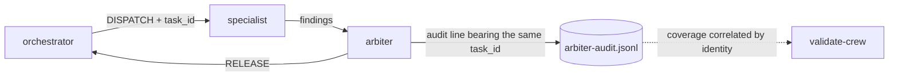

# psychic-crew

A from-scratch AI agent crew for IT-automation orchestration: eight specialised Claude Code subagents, a broker that all specialist output must pass through, hook-enforced guardrails, and a nine-phase FIFO build where every phase ends at a human gate.

Built to a fixed execution plan (`MASTER_FIFO_PLAN_CLAUDE.md`) with zero runtime dependencies. Nothing here installs anything.

## Quickstart

```bash
git clone https://github.com/nathan-hayashi/psychic-crew.git
cd psychic-crew
./scripts/setup.sh
```

`setup.sh` installs nothing. It checks the toolchain, recreates the gitignored runtime directories, verifies model routing, and runs the validation and app suites. Exit 0 means ready; any failure names itself.

**A human runs that first line; an agent working inside this repo cannot.** The in-repo deny-list blocks the clone verb under the no-installs constraint, and the guard matches the whole command string, so it refuses regardless of intent. That is deliberate and is why the portability drill proves the same property with `git archive` and a detached worktree instead — see the constraints section below and C-22.

**Requirements:** `git`, `node` ≥ 22, `npm`, `jq`. `gh` is optional. Tested on Node v24.14.0 / npm 11.9.0 under WSL2 Ubuntu 24.04.

**Auth:** this repo holds no secrets and needs none for anything above. Claude Code authentication is per-machine, not per-repo — check it with `claude auth status`, or `/status` inside a session. `gh auth status` matters only if you use the GitHub lanes. `.env`, `.env.*` and `secrets/` are both gitignored and blocked by `hooks/sensitive-guard.sh`; that guard is a backstop, not permission to put secrets in the tree.

## Verify it yourself

Every claim below is reproducible from a clean checkout:

```bash
./scripts/validate-crew.sh            # 37 structural assertions
./scripts/run-crew-tests.sh           # 144 crew assertions
./scripts/check-plan-corrections.sh   # plan-vs-reality registry, 24 entries
./scripts/portability-drill.sh        # proves the shipped file set works elsewhere
cd stress-project && npm test         # 18 cases, the JML simulator
```

## What the crew is

Eight agents, each with a narrow remit and a model chosen by scope — judgment that compounds gets Opus, narrow lenses get Sonnet. Model identity lives in exactly one file (`models.config.json`) and is stamped by `./scripts/apply-models.sh`; it is never written by hand anywhere.

| Agent                | Role                                                                              |
| -------------------- | --------------------------------------------------------------------------------- |
| `lead-planner`       | plans only, never edits                                                           |
| `lead-executor`      | executes approved plans step by step                                              |
| `arbiter`            | broker and covert auditor; normalises, recalibrates severity, logs every mutation |
| `fixer`              | steelmans findings, then applies — verdicts are `ACCEPT`/`REJECT`/`DEFER`         |
| `security-reviewer`  | secrets, permission widening, injection, destructive surfaces                     |
| `quality-reviewer`   | KISS/DRY/SoC, naming, coverage, documentation drift                               |
| `test-runner`        | runs suites, reports raw results, interprets nothing                              |
| `integration-runner` | end-to-end runs exactly as scripted                                               |

### The dispatch law

Nested dispatch does not exist in this runtime — a subagent cannot spawn another agent at any depth. The law that _can_ be enforced is therefore about consumption, not routing:



**No specialist output may be acted on until the arbiter has released it.** Every dispatch carries a `task_id`; the arbiter must emit an audit line bearing that same id. Coverage is correlated by identity, never by count — counting alone is satisfiable by the party being audited, which was observed live and is recorded as C-12.

### Review discourse

Two rounds, fixed grammar: `AGREE` (+1) · `CHALLENGE` (defended +1, undefended −1) · `CONNECT` (+1) · `SURFACE` (0). A reviewer may dismiss a suspected issue only with a mitigation it has located and read — "the framework escapes it" is an assumption, and the finding stands.

## Repo map

| Path                                   | What it holds                                                              |
| -------------------------------------- | -------------------------------------------------------------------------- |
| `.claude/agents/`                      | the eight agent definitions                                                |
| `.claude/rules/`                       | binding rules: arbiter protocol, fallback, model policy, security          |
| `hooks/`                               | 12 hooks — deny-list, model guard, secrets guard, audit logger, continuity |
| `scripts/`                             | validation, tests, model stamping, context distillation, setup, drills     |
| `context/`                             | distilled knowledge base; entry point `session-summary.md`                 |
| `stress-project/`                      | the JML simulator built as the final stress test                           |
| `GATES.md` · `PROGRESS.md` · `Plan.md` | gate ledger · compaction-safe checkpoints · live debugging log             |
| `MASTER_FIFO_PLAN_CLAUDE.md`           | the execution authority, never edited locally                              |

`DIRECTORY_GUIDE.md` is the fuller map. It is byte-pinned and drifts from the tree in places — see the open items below.

## The stress-project

A Joiner/Mover/Leaver identity-lifecycle simulator: HRIS webhook → IAM action → ticket → notification → audit trail. Node standard library only, 22 files, 18 tests, zero dependencies.

```bash
cd stress-project
node bin/jml.js fixtures/joiner-charmander.json --out /tmp/jml --now 2026-01-01T00:00:00Z --seed 1
```

The delivery file is **positional** — there is no `run` subcommand and no `--input`. Exit codes: `0` handled · `1` needs a human (parked) · `2` unusable input. With `--now` and `--seed` runs are byte-identical; without them they differ with probability 1.

## Constraints that shaped this build

- **From scratch** — no installs, no clones, no `npx`, no MCP servers. Node standard library only.
- **Claude-only** — no cross-vendor model invocation.
- **One file for model identity** — `models.config.json`, applied by script, never hand-edited.
- **Gates are exact tokens** — a phase advances only on `APPROVE GATE-Fn`, spelled exactly.
- **Uncertainty returns a FALLBACK block, never a guess** — with what is missing and what would resolve it.
- **Disk is canonical, context windows are caches** — every decision is written to its ledger at the moment it is made.
- **No absolute machine paths in tracked files** — paths resolve through environment variables.

The in-repo deny-list blocks the clone verb during agent work, which is why the portability drill proves the same property with `git archive` and a detached worktree instead. That is recorded as C-22, along with why the guard was not widened to accommodate the demo.

## What is proven, and what is not

**Proven.** 144 crew assertions and 37 structural assertions green from a clean checkout. The seeded-bug exercise caught 3 of 3, two of which were invisible to all 18 tests and found by reading alone — one of those independently by two blind review branches. Edge cases 3 of 3 exact. The portability drill passes by two mechanisms.

**Not proven, stated plainly.**

- The parked-replay path is green in tests but was never demonstrated in a live end-to-end run; no live replay is claimed.
- The arbiter holds no shell, so it witnessed no run — test and integration numbers are agent-captured, not arbiter-observed.
- Arbiter coverage for F7 is ordering-undecidable and always will be: the audit schema did not require a time-of-day timestamp until F8, so a line written after the fact cannot be distinguished from one written at the time. Fixed going forward, unrecoverable for F7 (C-19).
- Bypass detection is audit-based, caught at the gate rather than blocked at the call. `SubagentStart`/`SubagentStop` carry `agent_type` and would make it deterministic; adopting that is an open decision (C-05).
- The phase token budgets in the plan were never calibrated against multi-agent cost and were wrong by roughly an order of magnitude. Measured figures are in `context/budget-baseline.md` (C-20, C-21).

`context/plan-corrections.md` is the full registry: **24** numbered places where the plan and reality disagreed, what was done, and how to verify each. Where it and the plan conflict, it wins for implementation. The checker reports **21** of them as rows; C-16 is enforced in `validate-crew.sh` rather than by the registry's own detector, and C-17 is closed by completion — a mid-gate that was named without a token, since issued — so neither produces a row.

_This said 23 until 2026-08-17. The figure came from reading the highest correction ID and assuming no gaps, and C-15 had no entry, so it overcounted by one while the registry held 22. Corrected under CR-012 after CR-007 wrote C-15's entry and CR-032 added C-24._

## Licence

Unlicensed / all rights reserved. The five external repositories studied under the soft-ETL registry are knowledge substrate with attribution recorded in `CLAUDE_DESIGN.md`, never runtime dependencies.
