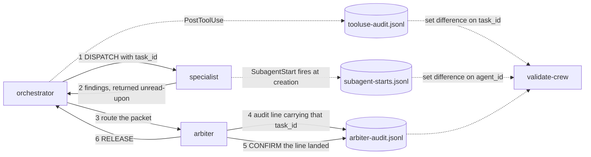
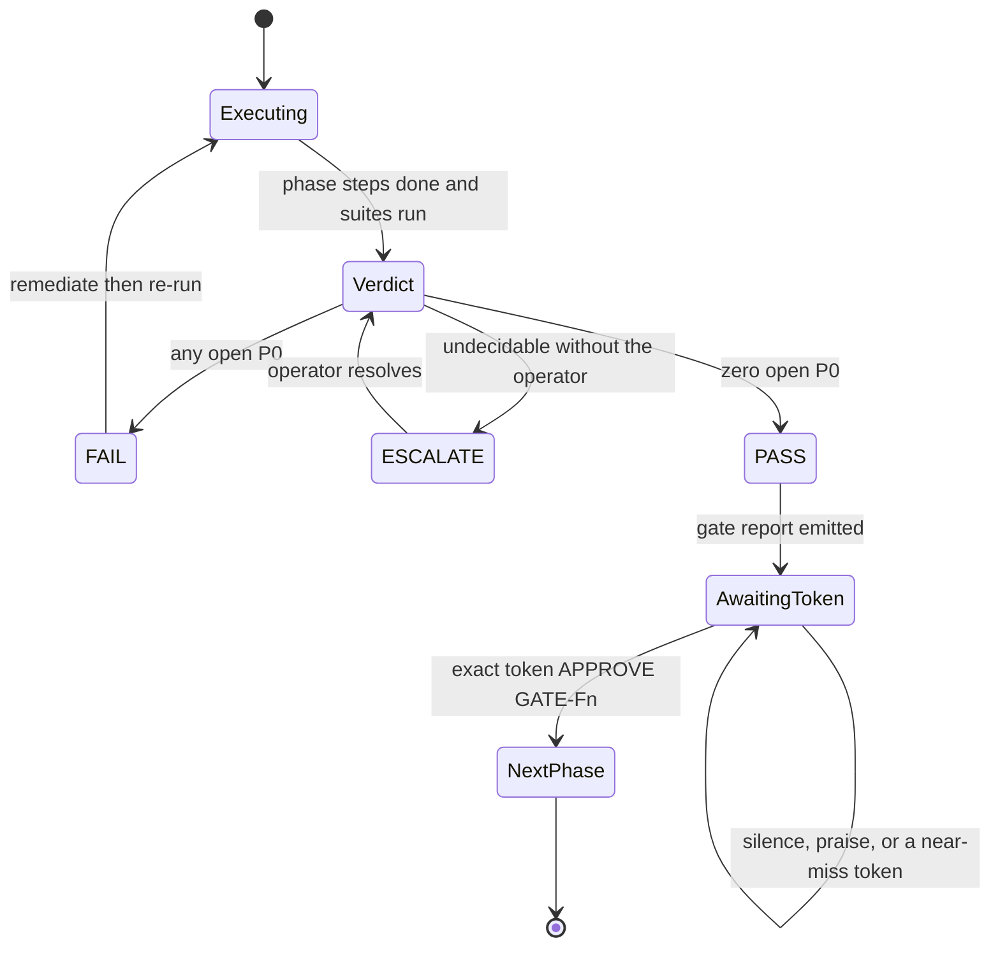
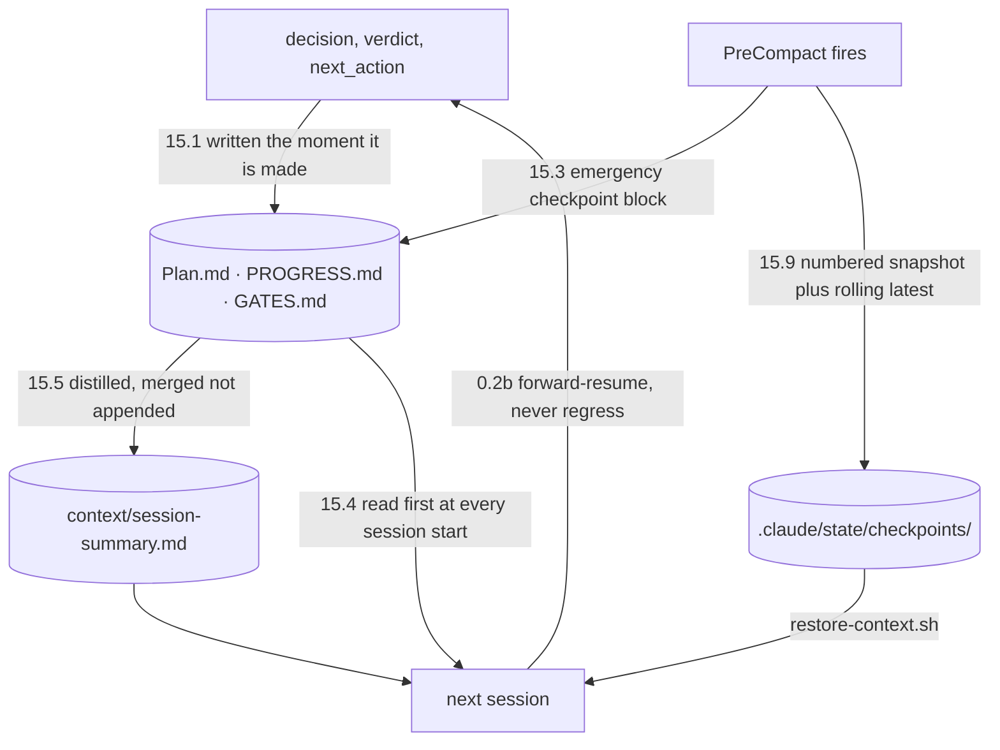

# psychic-crew

A from-scratch AI agent crew for IT-automation orchestration: eight specialised Claude Code subagents, a broker that all specialist output must pass through, hook-enforced guardrails, and a nine-phase FIFO build where every phase ends at a human gate.

Built to a fixed execution plan (`MASTER_FIFO_PLAN_CLAUDE.md`) with zero runtime dependencies. Nothing here installs anything.

**New here, or not technical?** Start with **[docs/GETTING-STARTED.md](docs/GETTING-STARTED.md)** — the plain-language guide. This README is the full technical reference.

## Quickstart

```bash
git clone https://github.com/nathan-hayashi/psychic-crew.git
cd psychic-crew
./scripts/setup.sh
```

`setup.sh` installs nothing. It checks the toolchain, recreates the gitignored runtime directories, verifies model routing, and runs the validation and app suites. Exit 0 means ready; any failure names itself.

**A human runs that first line; an agent working inside this repo cannot.** The in-repo deny-list blocks the clone verb under the no-installs constraint, and the guard matches the whole command string, so it refuses regardless of intent. That is deliberate and is why the portability drill proves the same property with `git archive` and a detached worktree instead — see the constraints section below and C-22.

**Requirements:** `git`, `node` ≥ 22, `npm`, `jq`. `gh` is optional. Tested on Node v24.14.0 / npm 11.9.0 under WSL2 Ubuntu 24.04. The full picture — hardware, disk, and what it actually costs to run — is in [Requirements](#requirements-measured) below.

**Auth:** this repo holds no secrets and needs none for anything above. Claude Code authentication is per-machine, not per-repo — check it with `claude auth status`, or `/status` inside a session. `gh auth status` matters only if you use the GitHub lanes. `.env`, `.env.*` and `secrets/` are both gitignored and blocked by `hooks/sensitive-guard.sh`; that guard is a backstop, not permission to put secrets in the tree.

## The twin repo

This build has a sibling: [psychic-crew-lite](https://github.com/nathan-hayashi/psychic-crew-lite) — a four-agent variant with no arbiter, a cross-release law in its place, and its own three-layer verification stack. It is not a subset: several of its mechanisms (the witness manifest, temporal history, declared claim bindings, stall detection) were built there first and ported back here.

Clone it **beside** this repo — its `check-sync.sh` correlates every shared artifact against this one and defaults to finding the parent at `../psychic-crew` under `$HOME/projects`; anywhere else, set `PSYCHIC_CREW_PARENT`. Its own README carries its quickstart. The correlation map (`docs/SYNC-CORRELATION.md` there) is the contract for what is byte-identical, deliberately different, or deliberately absent between the two.

## Requirements (measured)

Every figure here is measured from this build, not estimated from a template. `[E]` is measured
evidence; `[I]` is inference drawn from it and labelled as such.

### Platform

| Platform | What is required |
| --- | --- |
| **Linux** | `git`, `node` ≥ 22, `npm`, `jq`. Nothing else. |
| **macOS** | the same. No platform-specific code exists. |
| **Windows 10 22H2 / 11** | **WSL2 with Ubuntu 24.04**, hardware virtualization enabled. |

**On Windows, WSL2 is the runtime, not a fallback.** This project is bash-native end to end by
operator ruling (R1d): there is no PowerShell port of any script, hook or assertion, and no
Git-Bash bridge. PowerShell's only role is the one command `wsl --install`. If you are looking for a
native-Windows path, there isn't one, and that is a decision rather than an omission — the analysis
behind it is in `docs/audit/PLATFORM_GAP_POWERSHELL.md`.

`.gitattributes` pins `eol=lf` and stays regardless. It is not a Windows concession: a CRLF checkout
would fail the §4 seed byte-identity check that the whole build rests on.

### Footprint

| Fact | Value | |
| --- | --- | --- |
| Node / npm actually used | v24.14.0 / 11.9.0 | `[E]` |
| Tracked files / bytes | 153 files, ~2.3 MB | `[E]` |
| Runtime dependencies | **zero** — `stress-project/` is Node stdlib only | `[E]` |
| Disk beyond the checkout | `logs/` grows unbounded; ~2.5 MB after nine phases plus an audit | `[E]` |

### What it costs to run — the part no requirements section carries

This is the section a prospective user actually needs, and it is here because this build's own
budgets were wrong by nearly ten times. Publishing the measured figures is the honest correction.

| Fact | Value | |
| --- | --- | --- |
| Mean cost of one specialist dispatch | **~102,621 tokens** (30 dispatches, all phases) | `[E]` |
| Cheapest / dearest single dispatch | 35,550 / 198,302 — a **5.6×** spread | `[E]` |
| Cost of one full review round | ~250K tokens (two reviewers + arbiter) | `[I]` |
| Cost of a phase shaped like F7 | **~2.05M tokens** across 18 dispatches | `[E]` |
| Plan-tier implication | a phase of F7's shape is **not** a light-usage workload | `[I]` |

**The chart.** `docs/dispatch-cost.vl.json` plots the same numbers: per-dispatch context cost by
agent role, bars showing the mean per phase, individual dispatches as points, and a red rule at the
overall mean. It reads `docs/metrics-snapshot.json`, which is **tracked and generated** by
`./scripts/measure-dispatch-cost.sh` — the spec deliberately does not point at the measurement log,
because `logs/` is gitignored and a chart that renders empty from a fresh clone is not a
reproducible artifact.

**To view it you must paste it somewhere that renders Vega-Lite — GitHub does not.** Open
[vega.github.io/editor](https://vega.github.io/editor/), paste the spec, and load the snapshot
alongside it. There is no renderer in this repo and installing one is forbidden by the
no-installs constraint, so the honest position is that this ships as a *specification* you can
render elsewhere, not as an image. The suite validates that it parses, declares a schema, an
encoding and a mark, and that its data URL resolves to a tracked file; it does not and cannot
validate that the picture is a good one.

**Read the unit before using any of these.** They are subagent *context totals*, not output
produced: the same source read by eight agents is counted eight times. That is the right unit for
"what did this phase cost to run" and the wrong one for "how much work came out". Orchestrator
tokens are not measurable from inside a session and are excluded, so every figure is a **lower
bound**. The full derivation, the per-role distribution and the plot are in
`context/budget-baseline.md`.

**Auth:** this repo holds no secrets and needs none. Claude Code authentication is per-machine, not
per-repo.

## Verify it yourself

Every claim below is reproducible from a clean checkout:

```bash
./scripts/validate-crew.sh            # 54 structural assertions
./scripts/run-crew-tests.sh           # 234 crew assertions
./scripts/check-plan-corrections.sh   # plan-vs-reality registry, 26 registered ids
./scripts/portability-drill.sh        # proves the shipped file set works elsewhere
cd stress-project && npm test         # 18 cases, the JML simulator
```

The first two numbers are **asserted by the scripts themselves** — each compares this line against
its own total and fails if they disagree. They were stale by 7 and 21 when this section was written,
which is the drift a number nobody checks always reaches.

Both figures describe **a primary checkout**. Several assertions are gated on optional runtime
artifacts and several loop over files, so a `git archive` extract legitimately runs fewer — 42
rather than 44 for `validate-crew.sh`. The bindings say so instead of failing an environment that is
behaving correctly; `./scripts/portability-drill.sh` exercises exactly those environments.

## What the crew is

Eight agents, each with a narrow remit and a model chosen by scope — judgment that compounds gets Opus, narrow lenses get Sonnet. Model identity lives in exactly one file (`models.config.json`) and is stamped by `./scripts/apply-models.sh`; it is never written by hand anywhere.

| Agent                | Role                                                                              |
| -------------------- | --------------------------------------------------------------------------------- |
| `lead-planner`       | plans only, never edits                                                           |
| `lead-executor`      | executes approved plans step by step                                              |
| `arbiter`            | broker and covert auditor; normalises, recalibrates severity, logs every mutation |
| `fixer`              | steelmans findings, then applies — verdicts are `ACCEPT`/`REJECT`/`DEFER`         |
| `security-reviewer`  | secrets, permission widening, injection, destructive surfaces                     |
| `quality-reviewer`   | KISS/DRY/SoC, naming, coverage, documentation drift                               |
| `test-runner`        | runs suites, reports raw results, interprets nothing                              |
| `integration-runner` | end-to-end runs exactly as scripted                                               |

### The dispatch law

Nested dispatch does not exist in this runtime — a subagent cannot spawn another agent at any depth. The law that _can_ be enforced is therefore about consumption, not routing:



Read the numbered path carefully, because the shape is the point. **A specialist does not hand its
output to the arbiter.** Nested dispatch does not exist — a subagent cannot invoke another agent at
any depth — so findings return to the orchestrator, which routes them onward without acting on
them. An earlier version of this diagram drew a direct specialist → arbiter edge, which is the
architecture C-11 proved unexecutable.

Three trails feed the check, and they answer different questions. `tooluse-audit.jsonl` records
dispatches that **completed**; `subagent-starts.jsonl` records every subagent the runtime
**created**, whether or not the call then succeeded; `arbiter-audit.jsonl` is the coverage. Both
correlations are set differences, so surplus lines cannot mask a missing one — and the second trail
exists because `PostToolUse` cannot fire for a tool that never executed, which is how C-12 watched
a coverage denominator silently shrink.

**No specialist output may be acted on until the arbiter has released it.** Every dispatch carries a `task_id`; the arbiter must emit an audit line bearing that same id. Coverage is correlated by identity, never by count — counting alone is satisfiable by the party being audited, which was observed live and is recorded as C-12.

### The gate machine

Verdicts are exactly `PASS`, `FAIL` or `ESCALATE` — no composite verdicts, and "pass with
follow-ups" is a `PASS` plus logged `DEFER` items. `PASS` requires zero open P0. The part worth
drawing is what `PASS` does **not** do:



`PASS` reaches `AwaitingToken`, never the next phase. The only edge out is the **exact** token,
case-sensitive, no substitutes, and approval is never inferred from positive sentiment. The
self-loop is the whole control: a mistyped token leaves the machine exactly where it was, which is
what happened once in this build's history and is why the loop is drawn rather than assumed.

### Review discourse

Two rounds, fixed grammar: `AGREE` (+1) · `CHALLENGE` (defended +1, undefended −1) · `CONNECT` (+1) · `SURFACE` (0). A reviewer may dismiss a suspected issue only with a mitigation it has located and read — "the framework escapes it" is an assumption, and the finding stands.

### The hook pipeline

Eight events, thirteen wired hook scripts, and a shared preamble every one of them sources. Which
hook fires on which event — and under which matcher — is readable today only by parsing
`.claude/settings.json`. This is topology rather than flow, which is why it is d2.

**Stated plainly: there is no d2 renderer in this repository and HC-5 forbids installing one.** This
block is source that reads better than the JSON, not a picture anyone here can render. What makes it
worth tracking anyway is the next paragraph.

```d2
# Source of truth is .claude/settings.json — the PROJECT hook topology. run-crew-tests.sh
# compares every event -> hook edge below against it in BOTH directions, so this diagram cannot
# drift from the project file. User-scope hooks MERGE in addition at runtime (RETIRE-1: they are
# governed by the harness user layer's own laws and defer inside this repo; they are not drawn).

direction: right

blocking: can block the call {
  "bash-blocker.sh"
  "model-guard.sh"
  "sensitive-guard.sh"
}

advisory: observes or flags, never denies {
  "reference-cap.sh"
  "audit-logger.sh"
  "auto-format.sh"
  "provenance-flag.sh"
  "error-recovery.sh"
  "notify.sh"
}

continuity: continuity layer {
  "pre-compact-checkpoint.sh"
  "stop.sh"
  "session-start.sh"
  "subagent-start.sh"
}

PreToolUse -> blocking."bash-blocker.sh": Bash
PreToolUse -> blocking."model-guard.sh": Write|Edit
PreToolUse -> blocking."sensitive-guard.sh": Write|Edit
PreToolUse -> advisory."reference-cap.sh": Agent
PostToolUse -> advisory."audit-logger.sh": *
PostToolUse -> advisory."auto-format.sh": Write|Edit
PostToolUse -> advisory."provenance-flag.sh": Write|Edit
PostToolUseFailure -> advisory."error-recovery.sh": *
Notification -> advisory."notify.sh": *
PreCompact -> continuity."pre-compact-checkpoint.sh": auto|manual
Stop -> continuity."stop.sh": *
SessionStart -> continuity."session-start.sh": *
SubagentStart -> continuity."subagent-start.sh": *

preamble: "hooks/_common.sh" {
  style.stroke-dash: 3
}
preamble -> blocking: sourced by
preamble -> advisory: sourced by
preamble -> continuity: sourced by
```

**This is the first diagram in this repository that is checked for being _true_ rather than merely
well-formed.** Every other one — including the three above — is validated for fence integrity and
referential integrity only, because binding a picture to the behaviour it depicts is generally not
mechanically decidable. Here it is, because the depicted thing is a JSON file: the assertion
extracts every `event -> "hook.sh": matcher` triple from the block above, extracts the same triples
from `.claude/settings.json`, and fails on any difference in either direction. Add a hook without
drawing it and the suite fails; draw one that is not wired and the suite fails.

The grouping is a judgement and is **not** checked: only three hooks can actually block a call, and
reading `reference-cap.sh` as enforcement is the specific misreading that cost this build five
corrected sentences at S2.

## Repo map

| Path                                   | What it holds                                                              |
| -------------------------------------- | -------------------------------------------------------------------------- |
| `.claude/agents/`                      | the eight agent definitions                                                |
| `.claude/rules/`                       | binding rules: arbiter protocol, fallback, model policy, security          |
| `hooks/`                               | 13 wired hooks + `_common.sh` — deny-list, guards, audit, continuity       |
| `scripts/`                             | validation, tests, model stamping, context distillation, setup, drills     |
| `context/`                             | distilled knowledge base; entry point `session-summary.md`                 |
| `stress-project/`                      | the JML simulator built as the final stress test                           |
| `GATES.md` · `PROGRESS.md` · `Plan.md` | gate ledger · compaction-safe checkpoints · live debugging log             |
| `MASTER_FIFO_PLAN_CLAUDE.md`           | the execution authority, never edited locally                              |

`DIRECTORY_GUIDE.md` is the fuller map. It is byte-pinned and drifts from the tree in places — see the open items below.

## The stress-project

A Joiner/Mover/Leaver identity-lifecycle simulator: HRIS webhook → IAM action → ticket → notification → audit trail. Node standard library only, 22 files, 18 tests, zero dependencies.

```bash
cd stress-project
node bin/jml.js fixtures/joiner-charmander.json --out /tmp/jml --now 2026-01-01T00:00:00Z --seed 1
```

The delivery file is **positional** — there is no `run` subcommand and no `--input`. Exit codes: `0` handled · `1` needs a human (parked) · `2` unusable input. With `--now` and `--seed` runs are byte-identical; without them they differ with probability 1.

## Constraints that shaped this build

- **From scratch** — no installs, no clones, no `npx`, no MCP servers. Node standard library only.
- **Claude-only** — no cross-vendor model invocation.
- **One file for model identity** — `models.config.json`, applied by script, never hand-edited.
- **Gates are exact tokens** — a phase advances only on `APPROVE GATE-Fn`, spelled exactly.
- **Uncertainty returns a FALLBACK block, never a guess** — with what is missing and what would resolve it.
- **Disk is canonical, context windows are caches** — every decision is written to its ledger at the moment it is made.
- **No absolute machine paths in tracked files** — paths resolve through environment variables.

### How continuity actually survives a compaction

"Disk is canonical" is a doctrine; these are the layers that make it true. A context window is a
cache that can vanish mid-turn, so nothing load-bearing is allowed to exist only inside one:



The loop closes at the bottom: a new session re-grounds from disk and proceeds **forward only**,
never re-running an artifact that already exists. §15.9 is explicitly a workaround, not
architecture — it exists because compaction cannot be shaped from inside the session, and
`ROADMAP.md` records the condition under which it gets removed.

The in-repo deny-list blocks the clone verb during agent work, which is why the portability drill proves the same property with `git archive` and a detached worktree instead. That is recorded as C-22, along with why the guard was not widened to accommodate the demo.

## What is proven, and what is not

**Proven.** 234 crew assertions and 54 structural assertions green from a clean checkout. The seeded-bug exercise caught 3 of 3, two of which were invisible to all 18 tests and found by reading alone — one of those independently by two blind review branches. Edge cases 3 of 3 exact. The portability drill passes by three mechanisms — archive extract, detached worktree, and a clone-shaped consumer checkout.

**Not proven, stated plainly.**

- The parked-replay path is green in tests but was never demonstrated in a live end-to-end run; no live replay is claimed.
- The arbiter holds no shell, so it witnessed no run — test and integration numbers are agent-captured, not arbiter-observed.
- Arbiter coverage for F7 is ordering-undecidable and always will be: the audit schema did not require a time-of-day timestamp until F8, so a line written after the fact cannot be distinguished from one written at the time. Fixed going forward, unrecoverable for F7 (C-19).
- Bypass detection is **caught, never prevented**. `SubagentStart` supplies `agent_id` and `agent_type`, so attribution is deterministic and every specialist creation is recorded and correlated by identity — including dispatches that then failed, which the `PostToolUse` trail cannot see (C-25). But `SubagentStart` cannot block subagent creation, so prevention at the call is not available and is not claimed. This bullet previously said adopting the hooks would make detection deterministic; the attribution half was right, the prevention half never was.
- The phase token budgets in the plan were never calibrated against multi-agent cost and were wrong by roughly an order of magnitude. Measured figures are in `context/budget-baseline.md` (C-20, C-21).

`context/plan-corrections.md` is the full registry: **24** numbered places where the plan and reality disagreed, what was done, and how to verify each. Where it and the plan conflict, it wins for implementation. The checker reports **21** of them as rows; C-16 is enforced in `validate-crew.sh` rather than by the registry's own detector, and C-17 is closed by completion — a mid-gate that was named without a token, since issued — so neither produces a row.

_This said 23 until 2026-08-17. The figure came from reading the highest correction ID and assuming no gaps, and C-15 had no entry, so it overcounted by one while the registry held 22. Corrected under CR-012 after CR-007 wrote C-15's entry and CR-032 added C-24._

## Licence

MIT — see [LICENSE](LICENSE). Copyright (c) 2026 Nathan Lim (the canonical author identity, ruled
at S0-RECONCILE; the GitHub handle is an address, not a holder). Unlicensed/all-rights-reserved
until 2026-08-31, when the estate-wide MIT ruling landed. The external repositories studied under
the soft-ETL registry remain knowledge substrate with attribution recorded in `CLAUDE_DESIGN.md`,
never runtime dependencies.
