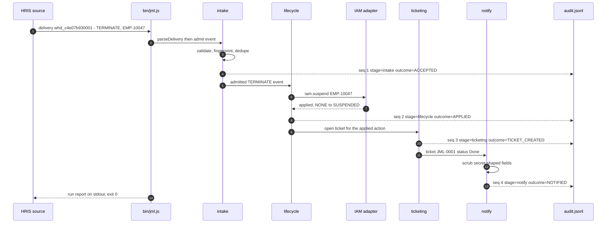

# jml — identity lifecycle simulator

A small IT-automation pipeline: an HRIS webhook delivery arrives, and the run drives it through
**intake → lifecycle → ticketing → notify**, appending one JSON Lines audit record per stage.
It models the Joiner / Mover / Leaver (JML) work an identity team automates — create an account for
a hire, transfer one for a move, suspend one for a termination — and it opens a ticket and posts a
chat notification for each action it takes.

Node standard library only. **Zero dependencies**, nothing to install, no build step. The diagram
below is a fenced `mermaid` block that GitHub renders natively, so there is no renderer binary, no
image artifact, and no CI render step in this project.

## The leaver path, end to end



Every arrow into `audit.jsonl` is a real line on disk. That is the assertable surface: the audit log
is what the test suite and the gate demo read back.

## Layout

```text
bin/jml.js            CLI entry point: arg parsing, stage sequencing, run report
src/intake.js         envelope parsing, per-event validation, fingerprint dedupe
src/lifecycle.js      state machine (NONE / ACTIVE / SUSPENDED), park-and-replay
src/ticketing.js      Jira-shaped ticket documents
src/notify.js         chat notification blocks + secret scrubbing
src/audit.js          JSONL audit log, stage constants, FALLBACK records
src/adapters/clock.js injectable clock (fixed or stepping)
src/adapters/iam.js   IAM actions: iam.create / iam.transfer / iam.suspend
fixtures/             six delivery envelopes: three happy, three edge
test/                 18 cases across six files
```

## Usage

Run everything below from this directory (`stress-project/`).

```bash
node bin/jml.js --help
```

The delivery file is a **positional argument** — there is no `run` subcommand and no `--input` flag.

```bash
# Leaver: suspend access for a terminated employee
node bin/jml.js fixtures/leaver-bulbasaur.json --out tmp/leaver --now 2026-08-13T17:00:00.000Z --seed demo

# Joiner: create an account for a new hire
node bin/jml.js fixtures/joiner-charmander.json --out tmp/joiner --now 2026-08-13T17:00:00.000Z --seed demo

# Read the delivery envelope from stdin instead of a file
node bin/jml.js - --out tmp/stdin --now 2026-08-13T17:00:00.000Z --seed demo < fixtures/leaver-bulbasaur.json
```

Each of those exits `0` and writes `audit.jsonl`, `state.json`, `tickets/JML-0001.json` and one file
under `notifications/` into the `--out` directory.

`--fail-iam` forces the downstream failure path — the ticket is still opened, with status `Failed`,
and the run exits `1` because a human has to finish it:

```bash
node bin/jml.js fixtures/leaver-bulbasaur.json --out tmp/failiam --now 2026-08-13T17:00:00.000Z --seed demo --fail-iam suspend
```

### Exit codes

| Code | Meaning        | When                                                                                 |
| ---- | -------------- | ------------------------------------------------------------------------------------ |
| `0`  | handled        | every admitted event reached a terminal outcome                                      |
| `1`  | needs a human  | something was parked or an IAM action failed; the run is not wrong, it is incomplete |
| `2`  | unusable input | the delivery could not be parsed at all; stdout is a FALLBACK block                  |

### Edge cases

```bash
# 1. Duplicate webhook delivery -> exit 0; the repeat stops at intake with outcome
#    DUPLICATE, so exactly one ticket and one notification exist afterwards
node bin/jml.js fixtures/edge-duplicate-webhook.json --out tmp/dup --now 2026-08-13T17:00:00.000Z --seed demo

# 2. MOVE for an employee never hired -> exit 1, outcome PARKED, nothing emitted to IAM
node bin/jml.js fixtures/edge-mover-before-hire.json --out tmp/park --now 2026-08-13T17:00:00.000Z --seed demo

# 3. Malformed payload (an HTTP response, not JSON) -> exit 2, FALLBACK block on stdout
node bin/jml.js fixtures/edge-malformed-payload.json.txt --out tmp/bad --now 2026-08-13T17:00:00.000Z --seed demo
```

Case 2 is also what `fixtures/mover-squirtle.json` does on its own — a MOVE for an employee with no
prior state parks rather than guessing, so that run exits `1` as well. Reusing one `--out` directory
across runs shares the state file and the audit log, which is how a parked event is replayed by a
later delivery for the same employee.

Case 3 does not throw or half-write: it emits the six-key FALLBACK block (`agent`, `task_id`,
`reason`, `missing`, `proposed_next_iteration`, `confidence`), writes exactly one audit line, and
opens no ticket and sends no notification.

## Determinism

`--now <iso>` fixes the clock and `--seed <string>` seeds generated ids. With **both** set, a run is
byte-identical to any other run of the same delivery:

```bash
node bin/jml.js fixtures/leaver-bulbasaur.json --out tmp/det-a --now 2026-08-13T17:00:00.000Z --seed demo
node bin/jml.js fixtures/leaver-bulbasaur.json --out tmp/det-b --now 2026-08-13T17:00:00.000Z --seed demo
diff -r tmp/det-a tmp/det-b
```

`diff` reports nothing and exits `0`. Drop `--now` and `--seed` and the same two runs differ — that
is the point: timestamps and ids are the only nondeterminism, and both are injected. This is what
makes the audit trail assertable rather than merely inspectable.

The audit records for the leaver run above:

```text
{"ts":"2026-08-13T17:00:01.000Z","seq":1,"stage":"intake","outcome":"ACCEPTED", ...}
{"ts":"2026-08-13T17:00:03.000Z","seq":2,"stage":"lifecycle","outcome":"APPLIED", ...}
{"ts":"2026-08-13T17:00:06.000Z","seq":3,"stage":"ticketing","outcome":"TICKET_CREATED", ...}
{"ts":"2026-08-13T17:00:08.000Z","seq":4,"stage":"notify","outcome":"NOTIFIED", ...}
```

## Tests

```bash
npm test
```

18 cases, 0 failures, exit `0`. The script is `node --test 'test/**/*.test.js'` — **the glob must be
quoted**, so the runner expands it rather than the shell. Passing a bare directory instead runs zero
cases and exits `1` on Node 22+, because `--test` positionals are globs and a directory is loaded as
a module.

Coverage spans intake validation and dedupe, the lifecycle transition table including the park path,
ticket and notification shape, secret scrubbing, audit ordering, and an end-to-end run per fixture.
